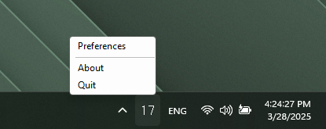

# Tray Ping
**Quick tool to ping internet at regular intervals and show the response time**

## What does it do ?
Pings www.google.com at a selected frequency, this address can be configured

 

> [!IMPORTANT]
> ## Tested on
> - Windows 11
> - Windows 10
 

inspired by [MenuPing](https://github.com/julienbordet/MenuPing) MacOS app

